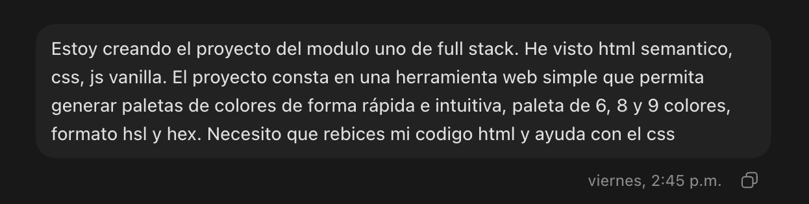
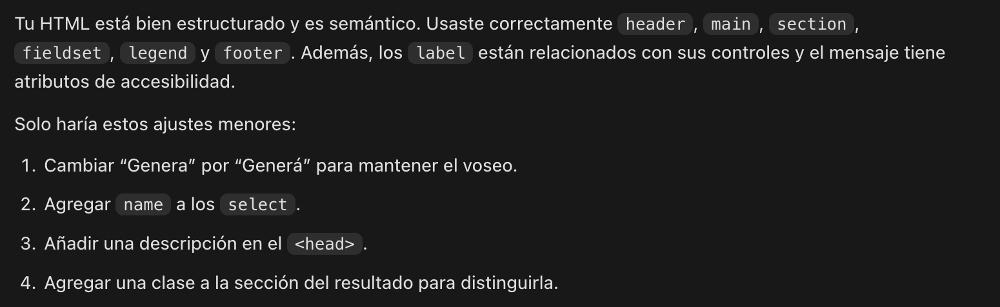
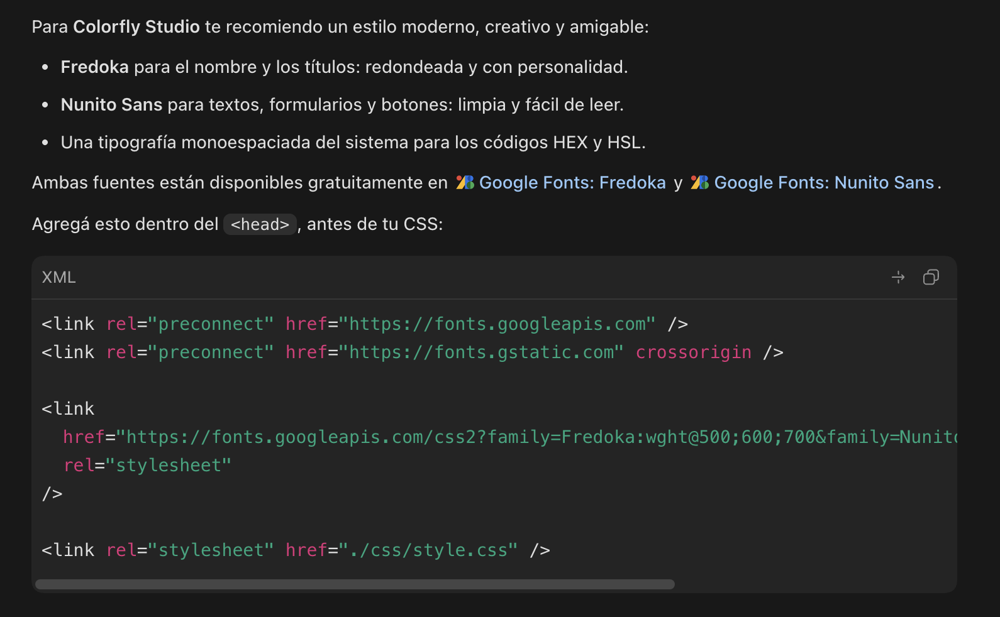
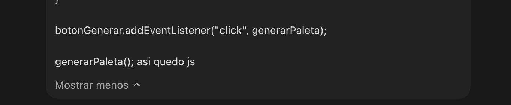
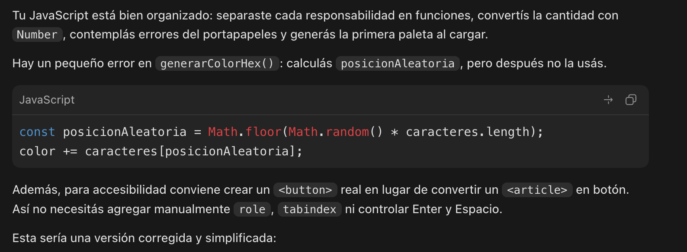
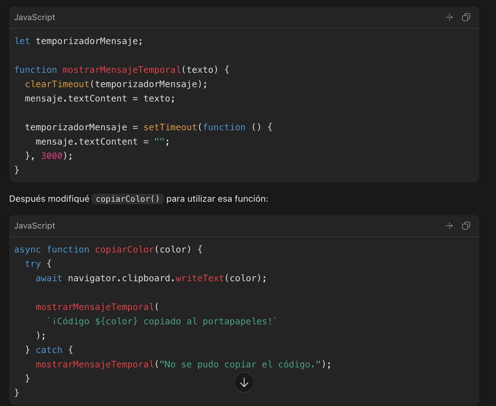

# Documentación de prompts utilizados

Durante el desarrollo de Colorfly Studio se utilizó una herramienta de inteligencia artificial Codex como apoyo para revisar el código, detectar oportunidades de mejora y comprender algunas decisiones técnicas.

Las sugerencias recibidas fueron analizadas y adaptadas a las necesidades del proyecto. Las capturas incluidas en este documento sirven como evidencia del proceso de consulta.

## 1. Revisión de HTML semántico

### Prompt

> Estoy creando el proyecto del Módulo 1 de Full Stack. He visto HTML semántico, CSS y JavaScript vanilla. El proyecto consiste en una herramienta web simple para generar paletas de 6, 8 y 9 colores en formato HSL y HEX. Necesito que revises mi código HTML y me ayudes con el CSS.

### Objetivo

Comprobar la estructura del documento y mejorar el uso de etiquetas semánticas y atributos de accesibilidad.

### Decisiones aplicadas

- Se ordenaron correctamente `head`, `body`, `header`, `main` y `footer`.
- Se utilizaron secciones identificadas mediante encabezados.
- Los controles se agruparon con `fieldset` y `legend`.
- Se relacionaron los `label` con sus selectores mediante `for` e `id`.
- Se agregó una región `aria-live` para comunicar mensajes.

### Evidencia visual

**Pregunta realizada:**

**Respuesta recibida:**

## 2. Estilos, colores y tipografías

### Prompt

> ¿Me dirías tipos de tipografía para darle estilo a la página?

### Objetivo

Definir una identidad visual clara y mantener una buena legibilidad en títulos, controles y códigos de color.

### Decisiones aplicadas

- Se eligió Poppins para encabezados y botones.
- Se utilizó Inter para el contenido general.
- Se definieron colores reutilizables mediante variables CSS.
- Se incorporaron gradientes, bordes redondeados y sombras.
- Se agregaron estados `hover`, `active` y `focus-visible`.

### Evidencia visual

**Pregunta realizada:**

**Respuesta recibida:**

## 3. Generación de paletas con JavaScript

### Prompt

> Así quedó mi JS.

En ese mensaje se compartió el contenido completo de `source/app.js`, que incluía la generación de colores HEX y HSL, la creación dinámica de tarjetas y la selección de paletas de 6, 8 o 9 colores.

### Objetivo

Revisar la lógica de generación de colores y la actualización dinámica de la interfaz.

### Decisiones aplicadas

- Los colores HEX se construyen con seis caracteres aleatorios.
- Los colores HSL utilizan rangos controlados de tono, saturación y luminosidad.
- La cantidad seleccionada se convierte a número antes de generar las tarjetas.
- Las tarjetas se crean dinámicamente con `document.createElement()`.
- Se corrigió una variable aleatoria que estaba declarada pero no se utilizaba.

### Evidencia visual

**Pregunta realizada:**

**Respuesta recibida:**

## 4. Copia al portapapeles y mensajes temporales

### Prompt

> Necesito que cuando apriete sobre el color aparezca el mensaje de copiado al portapapeles y después desaparezca.

### Objetivo

Dar una respuesta clara después de copiar un código sin dejar un mensaje permanente en la interfaz.

### Decisiones aplicadas

- Se utilizó `navigator.clipboard.writeText()` para copiar el color.
- Se creó una función reutilizable para mostrar mensajes temporales.
- El mensaje desaparece después de tres segundos mediante `setTimeout()`.
- El temporizador anterior se cancela con `clearTimeout()` cuando se copia otro color rápidamente.

### Evidencia visual

**Pregunta realizada:**

**Respuesta recibida:**

---

### [← Volver al README principal](../readme.md)